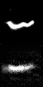

# Plasma Analysis via Variational Autoencoders (VAE)

## Overview

The goal of this project is to study images of a plasma generated during experiments. Each image corresponds to an experiment defined by two physical inputs: **Frequency ($F$)** and **Tension ($T$)**.

We aim to bridge the gap between visual data and physical parameters. Specifically, we want to create two functions:

1.  **Predictive Model:** Given an image, predict the physical parameters ($F, T$).
2.  **Generative Model:** Given physical parameters ($F, T$), generate a synthetic plasma image.

Mathematically, we seek functions $f$ and $g$ such that:

$$
f : \text{Im} \mapsto F, T \quad \text{and} \quad g: F,T \mapsto \text{Im}
$$

### Methodology

To achieve this, we propose a pipeline composed of three models:

1.  **Model 1 (VAE):** A [Variational Autoencoder](https://colab.research.google.com/drive/1v8wugMnPuaVClGW2VodrqmAkSlDIN0u3#scrollTo=6o7y9dBfbubs) trained to compress images into a latent space and reconstruct them. $V = D \circ E$ (Decoder $\circ$ Encoder).
2.  **Model 2 ($M_2$):** Predicts the VAE's latent values given the input Tension and Frequency.
3.  **Model 3 ($M_3$):** Predicts the Tension and Frequency given the VAE's latent values.

Formally, the complete functions are defined as:

$$
f : \text{Im} \mapsto F, T = M_3 \circ E \quad \text{and} \quad g: F,T \mapsto \text{Im} = D \circ M_2
$$

---

##  Installation & Setup

This project has been refactored to use **[uv](https://github.com/astral-sh/uv)** for high-speed dependency management and reproducibility.

### Clone the repository
```bash
git clone [https://github.com/julian-dqtr/plasma.git](https://github.com/julian-dqtr/plasma.git)
cd plasma
```

Then, install dependencies (this creates the virtual environment automatically):
```bash
uv sync
```

## Data

This repository is self contained with a sample dataset in the data folder. The structure of the dataset (once unzipped) is the following:
```
RUNS_PLASMA
├── Run01_Y_Z
│   ├── xxx1.tif
│   ...
│   └── xxxN.tif
├── Run02_Y_Z
...
```

where Y and Z and the physics inputs and xxx are meaningless names. Consequently, if you want to add your data, please follow a similar structure in order to get a smooth experience.

## How to train the VAE
You can launch training using uv run (no need to manually activate an environment):

```bash
uv run plasma/main.py
```
**NOTE:** The script will launch the training of all the models.

Here is an example of the evaluation of the image generated (bottom) given an input image (top) during training:



## Train the other two models

As described above, we want to train two other models. In the current pipeline, these models are not fully optimized and do not necessarily achieve state-of-the-art performance yet.

## Credits & Acknowledgments

* **Author & Lead Developer: Julian Dequatre**
    * Research, implementation of the VAE pipeline
    * Experimental data acquisition: Performed all laboratory measurements to generate the plasma dataset.
    * Refactoring and migration of the project to modern Python tooling (`uv`).

* **Supervision & Architecture: [Edouard Yvinec](https://github.com/EdouardYvinec)**
    * Project supervision and scientific guidance.
    * Design of the original repository structure and educational resources.


